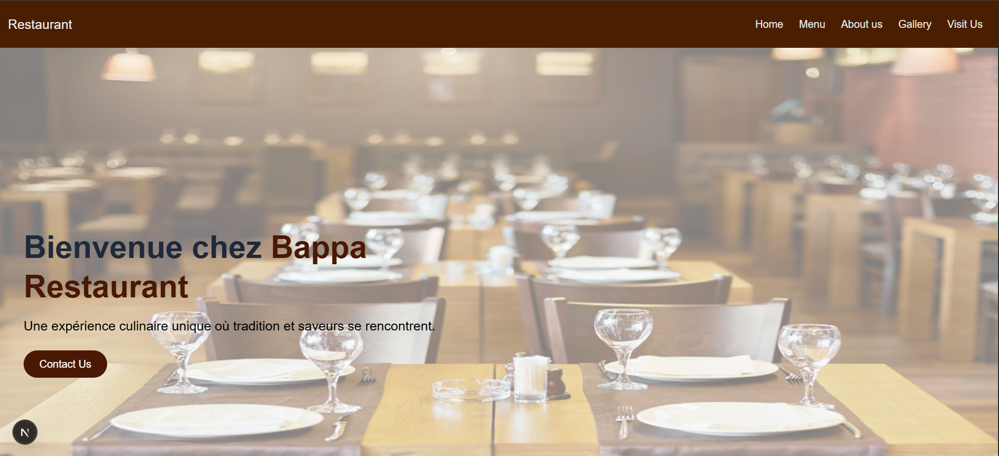

# Project Name: Restaurant Management & Commenting Platform

## 👥 Team Members
- **Mohamed KA**
- **Adja Sira DOUMBOUYA**
- **Sira DOUMBOUYA**

🔗 **Deployed URL:** webtech-211.vercel.app

---

## 1. Concept & User Experience

Plateforme moderne permettant la gestion d’un restaurant (section admin) et l’interaction des clients via les commentaires.  
L’expérience utilisateur a été pensée pour être fluide, rapide et intuitive avec une interface claire pour explorer le menu et laisser des avis.

### 🎨 Key Features (UI/UX)

- Page d’accueil moderne et responsive
- Authentification fluide (inscription / connexion / déconnexion)
- Système complet de gestion du menu côté admin (/admin)
- Consultation détaillée d’un plat via (/menu/[id])
- Ajout de commentaires par plat avec redirection intelligente (`?next=`)

📸 **Captures d’écran attendues**  
## Captures d’écran

### 📸 UI du menu

### 📸 Page admin

### 📸 Page de détails d’un plat

### 📸 Page commentaire

---

## 2. Full-Stack Functionality

### 🔑 Authentication

| Fonction | Statut |
|----------|--------|
| Sign-up | ✔ |
| Sign-in | ✔ |
| Sign-out | ✔ |
| UI update based on user state | ✔ |

**Notes**: Supabase Auth avec JWT. Après connexion, l’utilisateur est redirigé automatiquement vers l’action qu’il souhaitait (par ex. commenter un plat).

**Self-Evaluation**: Fonctionnalité robuste et intuitive, validation d’erreur et redirection bien gérées.

---

### 🛠 CRUD Operations

#### Main Resource: **Menu (Plats du restaurant)et utilisateurs**
| Action | Statut |
|--------|--------|
| Create | ✔ |
| Read | ✔ |
| Update | ✔ |
| Delete | ✔ |
| search | ✔ |

#### Secondary Resource: **Commentaires**
| Action | Statut |
|--------|--------|
| Create | ✔ |
| Read | ✔ |

**Self-Evaluation**: Les CRUD du menu sont complets et fonctionnels. Le système de commentaire ajoute une vraie dimension sociale.

---

### 🔗 Data Relationships

| Table Source | → | Table Cible |
|--------------|---|-------------|
| menu | 1:N | commentaires |
| users | 1:N | commentaires |

**Notes**: Suppression en cascade des commentaires lorsqu’un plat est supprimé.

**Self-Evaluation**: Relations propres, logiques et efficaces.

---

### 🔍 Search & Filtering
- Recherche instantanée des plats dans /menu et /admin
- Tri par prix + filtrage des commentaires par plat

**Self-Evaluation**: Très fluide, zéro latence visible.

---

### 🌍 External API Integration
| API | Usage |
|-----|--------|
| Supabase REST + Auth | BD, Auth, Policies |

**Self-Evaluation**: Intégration propre du SDK Supabase avec RLS activé.

---

## 3. Engineering & Architecture

### 📌 Database Schema

**Tables principales :**
- `auth.users`
- `menu`
- `commentaires`

**Champs clés :**
- menu: id, title, description, price, image
- commentaires: id, menu_id, user_id, titre, contenu

📸 **Schema screenshot attendu**

---

### 🔐 Row Level Security (RLS)

- Lecture publique du menu
- Création de commentaires autorisée uniquement aux utilisateurs connectés
- Admin : accès total via policy dédiée

📸 **RLS Dashboard screenshot attendu**

**Self-Evaluation**: RLS bien configuré, testé et fonctionnel.

---

### ⚙ Server vs Client Components

| Type | Fichier | Raison |
|------|---------|--------|
| Server Component | `/app/menu/[id]/page.tsx` | Récupération directe des données pour SEO et perf |
| Client Component | `/app/menu/page.tsx` | Recherche, interactivité, navigation dynamique |

---

## 4. Self-Reflection & Feedback
###  Proudest Achievement

| Membre | Réponse |
|--------|---------|
| **Mohamed** | Le système d’authentification avec redirection intelligente après login + la sécurité RLS. /frontend|
| **Adja** | La mise en page dynamique et le routage performant (/menu/[id])./backend |
| **Adja** | La fonctionnalité complète d’ajout et d’affichage des commentaires reliés aux plats. |

### 🔧 What Would You Improve?

| Membre | Réponse |
|--------|---------|
| **Mohamed** | Ajouter un dashboard utilisateur avec ses commentaires et favoris + upload d’images. |
| **Adja** | Ajouter la gestion des catégories de plats. |
| **Yassir** | Améliorer le système de notation par étoiles et permettre d’éditer un commentaire. |

###  Course Feedback (Bonus)

| Membre | Réponse |
|--------|---------|
| **Mohamed** | Projet très formateur, parfait pour comprendre Next.js + Supabase. |
| **Adja** | Hyper motivant d’avoir un rendu final déployé. |
| **Yassir** | Le combo théorie + pratique en situation réelle est la meilleure façon d’apprendre. |

